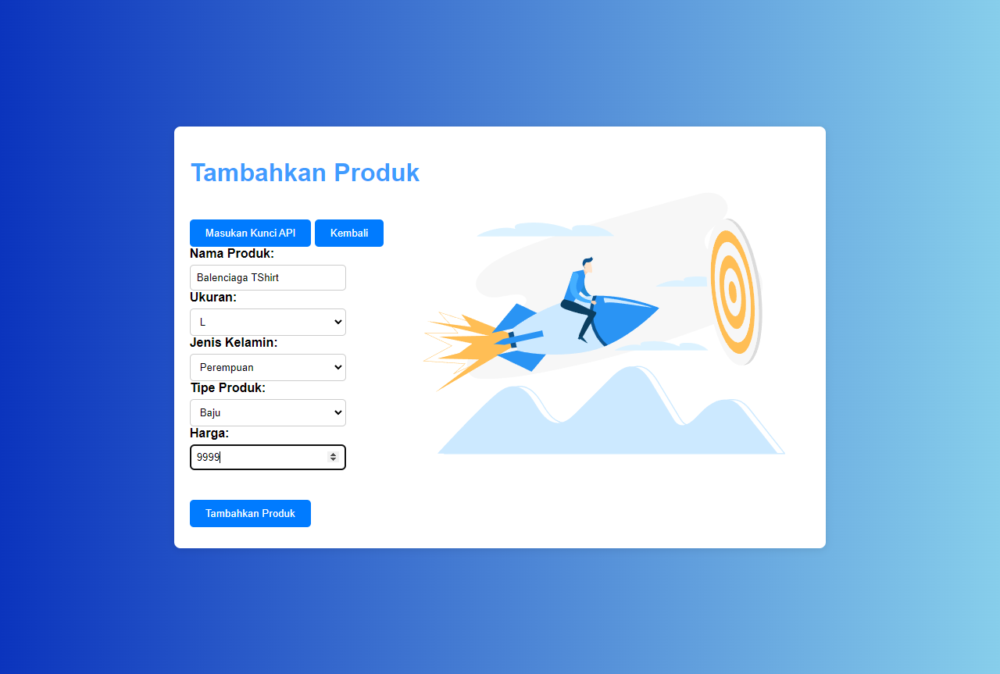
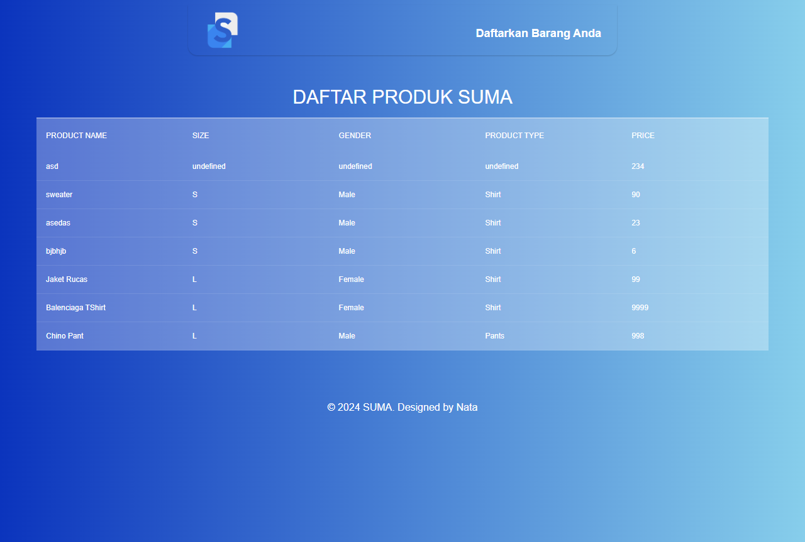
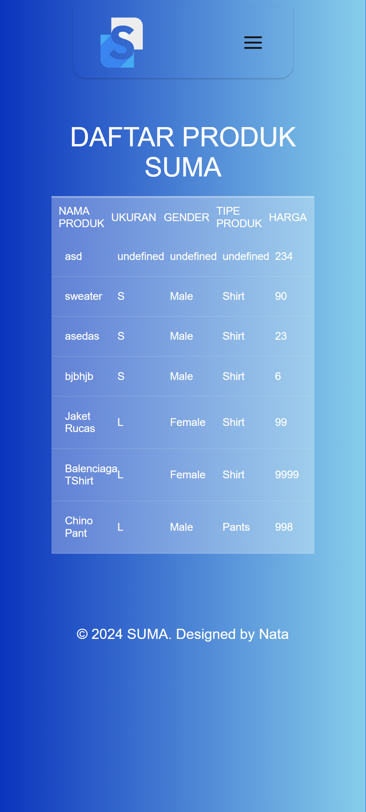
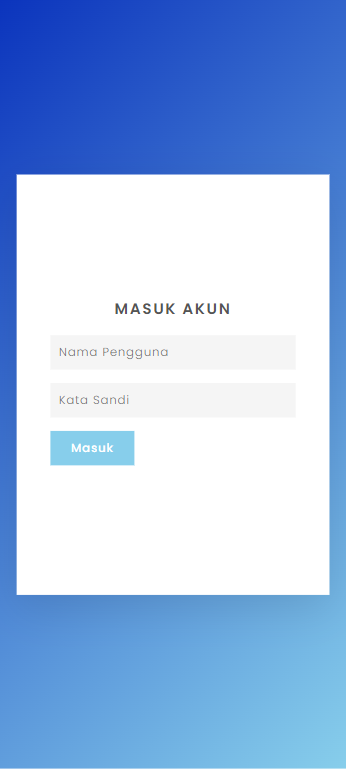

## WEB INI TANPA MENGGUANAKAN CSS ATAU JS FRAMEWORK
## Add JS DOM for Carousel Effect & Responsive
# Tugas P6, P7, P8 & P9 Arkatama

Repositori untuk memenuhi tugas petermuan 6, 7, 8 & 9 Arkatama
# Changelog:

Pertemuan 9 

```bash
  - Login
  - Responsive
```

Pertemuan 8 

```bash
  - WEB API
  - CRUD
```

Pertemuan 7

```bash
  - Landingpage 
  - Js DOM
```
Pertemuan 6

```bash
  - Carousel
  - Landingpage
  - Form
  - Js Basic
```

## Authors

- Nama: Mohammad Arbi Yoganata
- Universitas: Universitas Islam Balitar
- Program Studi: Teknik Informatika 
- Kelas: FSWD 3


## Screenshots

# Landing Page (Index.html)


# Landing Page Js DOM (landingdom.html)


# Tambahkan Produk (productarray.html)


# Tampilan Produk (productapi.html)


# Tampilan Produk Responsif (product-responsive.html)


# Login Responsif (login-responsive.html)


# Form Page (form.html)


# JSDasar Page (jsdasar.html)
